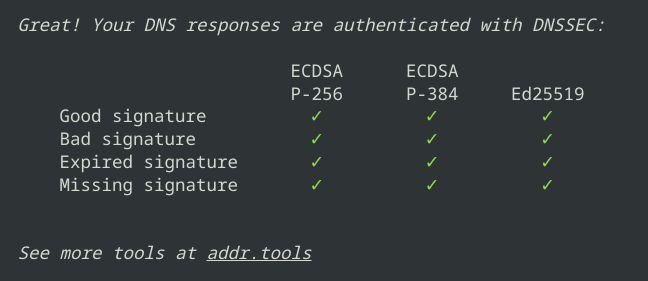

# Unbound (sinkhole) on a 🍏 Mac V.2

## Introduction to Setting Up Unbound (Sinkhole) on a Mac

This guide walks you through the process of setting up Unbound, a validating, recursive, and caching DNS resolver, on your Mac using MacPorts. The primary goal is to create a DNS sinkhole, which is a security mechanism used to intercept and block malicious traffic. By configuring Unbound on your Mac, you can improve your network security, enhance privacy by using DNS over TLS, and block unwanted ads and trackers.

### Why Use MacPorts?

MacPorts is a package management system that simplifies the installation of software on macOS. It installs software into `/opt/local`, which closely resembles the FreeBSD ports system, making it easier for users familiar with FreeBSD. This guide leverages MacPorts to install and manage Unbound and other necessary tools.

### Steps to Achieve the Goal

1. **Install MacPorts:** Set up MacPorts on your Mac to easily manage software installations.
2. **Install Unbound:** Use MacPorts to install Unbound and configure it as your DNS resolver.
3. **Configure Unbound:** Set up Unbound with the necessary configurations, including downloading the root hints file and setting up DNSSEC validation.
4. **Control Unbound:** Learn how to manage Unbound using commands for loading, unloading, and reloading the service.
5. **Set Up Ad-Blocking:** Configure Unbound to block ads and trackers by using blocklists.
6. **Schedule Regular Updates:** Use launchd or periodic scripts to keep your blocklists up-to-date.
7. **Secure Unbound:** Configure Unbound to use DNS over TLS for secure DNS queries.
8. **Log Management:** Set up log rotation to manage Unbound's log files effectively.

By following this guide, you will have a robust DNS setup on your Mac that enhances security, privacy, and browsing experience by blocking unwanted content. The detailed steps ensure that even users new to DNS configuration can achieve a secure and efficient setup.

## ⚙️ Install MacPorts

Ports installs into: ```/opt/local```
This is very similar to FreeBSD which makes everything easier for me.

After installation, MacPorts modifies your `.zprofile` to include its paths:

```sh
# MacPorts Installer addition on 2023-05-08_at_08:30:54: adding an appropriate PATH variable for use with MacPorts.
export PATH="/opt/local/bin:/opt/local/sbin:$PATH"
# Finished adapting your PATH environment variable for use with MacPorts.
```

As of this writing "`v.2`" I downloaded the ventura package with brew's wget (yes i have both brew and MacPorts installed)

```doas installer -pkg MacPorts-2.9.3-13-Ventura.pkg -target /```

```
## MacPorts

    export PATH=/opt/local/bin:/opt/local/sbin:$PATH
    export MANPATH=/opt/local/share/man:$MANPATH
    export DISPLAY=:0.0
```

## Install opendoas

These days I hear `opendoas` is preferred over `sudo` for its simplicity and ease of configuration. Install it via MacPorts:

```port install opendoas ```
**Configure `opendoas`:**

`cat /opt/local/etc/doas.conf`

```sh
# Please see doas.conf manual page for information on setting
# up a doas.conf file.

# Permit members of the admin group to perform actions as root.
permit :admin

## Added by Me:
## https://forums.freebsd.org/threads/doas-sudo-alternative.69219/

permit nopass keepenv wheel
permit nopass keepenv adminuser1
permit nopass keepenv adminuser2
permit nopass keepenv root as root
permit nopass :admin
```

## Install Unbound
To setup unbound on FreeBSD I followed this very nice tutorial: https://loga.us/2014/08/03/unbound-caching-and-nsd-local-authoritative-master-slave-dns-server-part-1/
When I was looking for a way to run unbound on a mac I found this site: https://brianreiter.org/2020/06/24/encrypting-dns-on-macos-with-unbound-and-cloudflare which was a good start.

```sh
doas port install unbound
cd /opt/local/etc/unbound
doas cp unbound.conf-dist unbound.conf
doas port load unbound
```

# 🧰 Configure

## Download root.hints file

Before starting to configure unbound.conf, unbound needs a root.hints file which lists the primary DNS Servers. Unbound comes with a listing of the root DNS Servers in its code, but this ensures the most up to date copy on each server.

A good practice is to update this file every six months.

```doas wget ftp://FTP.INTERNIC.NET/domain/named.cache -O /opt/local/etc/unbound/root.hints```

Nota bene Additionally, Unbound requires an auto-trust-anchor-file. It contains a key in order for DNSSEC to be validated.

## Generate the root.key

To generate the root.key execute the following command:

```sh
cd /opt/local/etc/unbound
doas unbound-anchor -a "/opt/local/etc/unbound/root.key"
```

## setup unbound-control

Next step is to generate the keys needed for Unbound to be controlled by unbound-control (8).

```sh
cd /opt/local/etc/unbound
doas unbound-control-setup
```

## 🛂 Control unbound

| MacPorts     | commands              |
| -------------- | ----------------------- |
| ▶️**Load** | `port load unbound`   |
| ⏹**Unload** | `port unload unbound` |
| ⏯**Reload** | `port reload unbound` |

## remote-control:

This configuration snippet is for setting up remote control access to the Unbound DNS resolver using the ```unbound-control``` (```/opt/local/sbin/unbound-control```) utility. This allows you to manage and control the Unbound DNS server remotely.

```sh
**# Enable remote control with unbound-control(8) here.**
control-enable: **yes**

**# Set interfaces for remote control.**
control-interface: 127.0.0.1

**# Unbound server key and certificate files.**
server-key-file: **"/opt/local/etc/unbound/unbound_server.key"**
server-cert-file: **"/opt/local/etc/unbound/unbound_server.pem"**
control-key-file: **"/opt/local/etc/unbound/unbound_control.key"**
control-cert-file: **"/opt/local/etc/unbound/unbound_control.pem"**
```

## Unbound Log Files

Create a directory for Unbound log files:

```sh
cd /opt/local/etc/unbound
mkdir log
touch /opt/local/etc/unbound/log/unbound.log
chown unbound log
```

## setup ad-blocking

FreeBSD Sinkhole: From website: [~gbmor :: blog ](https://gbmor.org/blog/2021-10-20_01_local-unbound_sinkhole.html)

### Fetch and set up adblock sources:

### 👉🏻 Setup sources

Now we're going to grab the adblock-unbound sources, then move it to where it's going to live.

```sh
# git clone --depth=1 https://github.com/lepiaf/adblock-unbound.git
# chmod +x adblock-unbound/entrypoint.sh
# mv adblock-unbound/entrypoint.sh /opt/local/etc/unbound
```

#### Create the entrypoint script:

```cat /opt/local/etc/unbound/entrypoint.sh```

```sh
#!/usr/bin/env sh

URL_CNAME_TRACKERS=https://raw.githubusercontent.com/AdguardTeam/cname-trackers/master/combined_disguised_trackers_justdomains.txt
URL=https://raw.githubusercontent.com/StevenBlack/hosts/master/hosts
if [ "$RECIPE" != "master" ]
then
  URL=https://raw.githubusercontent.com/StevenBlack/hosts/master/alternates/$RECIPE/hosts
fi

/usr/local/bin/wget -q $URL -O - | grep '^0\.0\.0\.0' | awk '{print "local-zone: \""$2"\" redirect\nlocal-data: \""$2" A 0.0.0.0\"\n"}' > /tmp/adblock-unbound
/usr/local/bin/wget -q $URL_CNAME_TRACKERS -O - | grep -v -e '^[[:space:]]*$' | grep -v "^#" | awk '{print "local-zone: \""$1"\" redirect\nlocal-data: \""$1" A 0.0.0.0\"\n"}'  >> /tmp/adblock-unbound

if [ "$WITH_IPV6" = "true" ]
then
  /usr/local/bin/wget -q $URL -O - | grep '^0\.0\.0\.0' | awk '{print "local-data: \""$2" AAAA ::\"\n"}' >> /tmp/adblock-unbound
  /usr/local/bin/wget -q $URL_CNAME_TRACKERS -O - | grep -v -e '^[[:space:]]*$' | grep -v "^#" | awk '{print "local-data: \""$1" AAAA ::\"\n"}'  >> /tmp/adblock-unbound
fi

cat /tmp/adblock-unbound
rm /tmp/adblock-unbound
```

<i>🪛 at some point I hard-coded the path to wget because root's sh wasn't finding it.</i>

### 🏃🏻 Fetch the initial blocklist

Run these commands to fetch the initial blocklist:

```sh
# cd /opt/local/etc/unbound  
# mkdir conf.d
# RECIPE=master WITH_IPV6=false /opt/local/etc/unbound/entrypoint.sh > /opt/local/etc/unbound/conf.d/ads.conf
# chown -R unbound:unbound conf.d
```

### ⏱ Create adblock-refresh.sh

Create a script to update the blocklist:

Let's add the script that <s>```cron```</s> ```launchd``` will call to update our block list. I know it doesn't really need to be executable because we can always just call it with sh. Add the lines to the file and save it.

```sh
# touch adblock-refresh.sh
# chmod +x adblock-refresh.sh
# chown unbound:unbound adblock-refresh.sh
# nano adblock-refresh.sh
```

#### Script content:

```cat /opt/local/etc/unbound/adblock-refresh.sh```

```sh
RECIPE=master WITH_IPV6=false /opt/local/etc/unbound/entrypoint.sh > /opt/local/etc/unbound/conf.d/ads.conf
#unbound-control reload
/opt/local/sbin/unbound-control reload
```

## Schedule with `launchd`

### Create a `launchd` script for periodic updates:

`cat /Library/LaunchDaemons/org.adblock-refresh.plist`

```sh
<!DOCTYPE plist PUBLIC "-//Apple//DTD PLIST 1.0//EN" 
"http://www.apple.com/DTDs/PropertyList-1.0.dtd">
<plist version="1.0">
<dict>
        <key>Label</key>
        <string>AdBlockRefresh</string>
        <key>ProgramArguments</key>
        <array>
                <string>bash</string>
                <string>-c</string>
                <string>/opt/local/etc/unbound/adblock-refresh.sh</string>
        </array>
        <key>RunAtLoad</key>
        <true/>
        <key>StandardErrorPath</key>
        <string>/tmp/AdBlockRefresh.err</string>
        <key>StandardOutPath</key>
        <string>/tmp/AdBlockRefresh.out</string>
        <key>StartInterval</key>
        <integer>9999</integer>
</dict>
</plist>
```

Then to load run:
`doas launchctl load /Library/LaunchDaemons/org.adblock-refresh.plist`

## 📜 Another way: Use Periodic Daily for Ad-Blocking updates

We can generate the ad block list a different way that doesn't involve creating a `launchd` script with a simple periodic script.

You can find periodic scripts in `/etc/periodic/daily`, `/etc/periodic/weekly`, and `/etc/periodic/monthly`. You can also put your own scripts in there (**root-owned, 755 permissions** ), and they’ll run alongside the ones that come with macOS.

According to `/etc/defaults/periodic.conf`, though, there’s another recommended place to put scripts:

```
# periodic script dirs
 local_periodic="/usr/local/etc/periodic"
```

So that would be `/usr/local/etc/periodic/daily`, `/usr/local/etc/periodic/weekly`, and `/usr/local/etc/periodic/monthly`.

Having your scripts separated from the built-in scripts may be a good
idea, even though they’ll run fine alongside the built-in scripts.

### Create a periodic script to update the blocklist daily:

```sh
mkdir /usr/local/etc/periodic
mkdir /usr/local/etc/periodic/daily
nano /usr/local/etc/periodic/daily/999.adblock
chmod 755 /usr/local/etc/periodic/daily/999.adblock
port install fetch
doas periodic daily
```

#### Script content:

```sh
#!/bin/bash

BlocklistURL=${1:-"https://raw.githubusercontent.com/StevenBlack/hosts/master/hosts"}
AdBlockPath=${2:-"/opt/local/etc/unbound/conf.d/adblock.conf"}
LogFile=${3:-"/var/log/adblock-update.log"}
ExporterPath=${4-"/var/tmp/node_exporter"}

## add timestamp to LogFile
if [ ! -f ${LogFile} ]; then
    touch ${LogFile}
fi
echo $(date +%F) >> ${LogFile}

## add linecount of adblock file to LogFile
if [ ! -f ${AdBlockPath} ]; then
    touch ${AdBlockPath}
fi
wc -l ${AdBlockPath} >> ${LogFile}

## fetch blocklist url & generate adblock.conf
/opt/local/bin/fetch -o - ${BlocklistURL} | awk '/^0.0.0.0/ {print "local-zone: \""$2"\" redirect\nlocal-data: \""$2" A '0.0.0.0'\""}' > ${AdBlockPath}

## log new line count of adblock.conf
wc -l ${AdBlockPath} >> ${LogFile}

## end of log entry
echo "-----" >> ${LogFile}

## reload service
port reload unbound

if [ -d ${ExporterPath} ]; then
    echo "# HELP node_unbound_adblock_count This is the count of adblock domains found in unbound" | tee "${ExporterPath}/node_unbound_adblock_count.prom"
    echo "# TYPE node_unbound_adblock_count gauge" | tee -a "${ExporterPath}/node_unbound_adblock_count.prom"
    echo "node_unbound_adblock_count $(wc -l ${AdBlockPath} | awk '{ print $1 }')" | tee -a "${ExporterPath}/node_unbound_adblock_count.prom"
fi
```

This will update the `/opt/local/etc/unbound/conf.d/adblock.conf` file daily

## Securing unbound

https://www.ctrl.blog/entry/unbound-tls-forwarding.html

### Install ca-bundle

`doas port install curl-ca-bundle`

### configure

`tls-upstream: yes`

This setting enables Unbound to send DNS queries over TLS (Transport Layer Security) to upstream servers. This provides encryption for the DNS queries, ensuring privacy and security by preventing eavesdropping and tampering.

`tls-cert-bundle: "/opt/local/share/curl/curl-ca-bundle.crt"`

This specifies the path to the certificate bundle that Unbound will use to authenticate the TLS connections to upstream servers. The certificate bundle contains a list of trusted Certificate Authorities (CAs) that Unbound uses to verify the authenticity of the upstream DNS servers.

```sh
forward-zone:
    name: "."
    forward-tls-upstream: yes
```

This defines a forward zone for the root (".") zone, which means it applies to all DNS queries. The `forward-tls-upstream: yes` setting ensures that all DNS queries forwarded to the specified upstream servers are sent over TLS.

### Upstream DNS Servers

```sh
# Cloudflare DNS Malware
    forward-addr: 2606:4700:4700::1112@853#cloudflare-dns.com
    forward-addr: 1.1.1.2@853#cloudflare-dns.com
    forward-addr: 2606:4700:4700::1002@853#cloudflare-dns.com
    forward-addr: 1.0.0.2@853#cloudflare-dns.com

    ## Quad9
    forward-addr: 9.9.9.9@853#dns.quad9.net
    forward-addr: 149.112.112.112@853#dns.quad9.net
    forward-addr: 2620:fe::fe@853#dns.quad9.net
    forward-addr: 2620:fe::9@853#dns.quad9.net

    ## Cloudflare
    forward-addr: 1.1.1.1@853#cloudflare-dns.com
    forward-addr: 1.0.0.1@853#cloudflare-dns.com
    forward-addr: 2606:4700:4700::1111@853#cloudflare-dns.com
    forward-addr: 2606:4700:4700::1001@853#cloudflare-dns.com

    ## Cloudflare Malware and Adult Content
    forward-addr: 1.1.1.3@853#family.cloudflare-dns.com
    forward-addr: 1.0.0.3@853#family.cloudflare-dns.com
    forward-addr: 2606:4700:4700::1113@853#family.cloudflare-dns.com
    forward-addr: 2606:4700:4700::1003@853#family.cloudflare-dns.com
```

it should look something like this:

```sh
# request upstream over TLS (with plain DNS inside the TLS stream).
	# Default is no.  Can be turned on and off with unbound-control.
  
    tls-upstream: yes

	# Certificates used to authenticate connections made upstream.
	tls-cert-bundle: "/opt/local/share/curl/curl-ca-bundle.crt"

    forward-zone:
    name: "."
    forward-tls-upstream: yes

    ## Quad9
    forward-addr: 9.9.9.9@853#dns.quad9.net
    forward-addr: 149.112.112.112@853#dns.quad9.net
    forward-addr: 2620:fe::fe@853#dns.quad9.net
    forward-addr: 2620:fe::9@853#dns.quad9.net
```

I used dnscheck.tools to check if my configuration setup correctly:

[dnscheck.tools](https://www.dnscheck.tools/https:/)



And indeed it was working as intended.

## LOG ROTATION

IMPORTANT: if you enabled and configured unbound logs you must rotate them.

Install logrotate from MacPorts

```sh
doas port install logrotate

 logrotate has the following notes:
    To use logrotate:

      * See 'man logrotate' for configuration options.

      * Enable daily log rotation with this command.

        $ doas port load logrotate

      * To create your own startup item with non-default intervals, build logrotate
        without the startupitem variant (-startupitem), copy the example into place
        and edit to your liking, then load with launchctl when finished.

        $ doas cp /opt/local/share/logrotate/org.macports.logrotate.plist.example /Library/LaunchDaemons/org.macports.logrotate.plist

        $ doas launchctl load -w /Library/LaunchDaemons/org.macports.logrotate.plist
```

### Add your logrotate scripts to this directory for convenient inclusion.

`include /opt/local/etc/logrotate.d`

`cat /opt/local/etc/logrotate.d/unbound.conf`

```sh
/opt/local/etc/unbound/log/unbound.log {
    #hourly
    size 100k
    rotate 7
    nodateext ## ADD THIS LINE ##
    missingok
    notifempty
    compress
    compresscmd /usr/bin/bzip2
    compressext .bz2
    maxage 100
    #delaycompress
    sharedscripts
    create 664
    postrotate
    /opt/local/sbin/unbound-control log_reopen
    endscript
}
```

**Updating the Registry:**

MacPorts maintains a registry that keeps track of all installed ports and their statuses. During activation, the registry is updated to reflect that logrotate is now active. This helps MacPorts manage dependencies and handle future upgrades or deactivations.

```sh
doas port activate logrotate
```

Test it out: ensure that logrotate will run by runnning a test.

```sh
doas logrotate -v -f /opt/local/etc/logrotate.d
```

Results should look as follows:

```sh
-rw-rw-r--   1 unbound  unbound        0 Jul 21 14:47 unbound.log
-rw-rw-r--   1 unbound  unbound      253 Jul 21 14:47 unbound.log.1.bz2
-rw-r--r--   1 unbound  unbound  1067260 Jul 21 14:44 unbound.log.2.bz2
```
# Example configuration
## unbound.conf

```apache
server:

	verbosity: 1
    interface: 0.0.0.0
	port: 53
	num-threads: 4

	# buffer size for UDP port 53 incoming (SO_RCVBUF socket option).
	# 0 is system default. Use 4m to catch query spikes for busy servers.
	so-rcvbuf: 1m

	# buffer size for UDP port 53 outgoing (SO_SNDBUF socket option).
	# 0 is system default. Use 4m to handle spikes on very busy servers.
	so-sndbuf: 1m 

	# the amount of memory to use for the message cache.
	# plain value in bytes or you can append k, m or G. default is "4Mb". 
	msg-cache-size: 128m

	# the amount of memory to use for the RRset cache.
 	# plain value in bytes or you can append k, m or G. default is "4Mb". 
	rrset-cache-size: 256m

	do-ip4: yes
	do-ip6: yes
	do-udp: yes
	do-tcp: yes
	access-control: ::ffff:127.0.0.1 allow
	access-control: 192.168.40.0/24 allow
	access-control: 172.40.0.0/24 allow
	access-control: 10.0.2.0/24 allow
	chroot: "/opt/local/etc/unbound"
	username: "unbound"
	directory: "/opt/local/etc/unbound"
	logfile: "/opt/local/etc/unbound/log/unbound.log"
	log-identity: "435-Office-PA-iMac11"
	log-time-ascii: yes
	log-queries: yes
	log-replies: yes
	log-servfail: yes
        extended-statistics: yes
	pidfile: "/opt/local/etc/unbound/unbound.pid"
	hide-identity: yes
	hide-version: yes
	qname-minimisation: yes
	auto-trust-anchor-file: "/opt/local/etc/unbound/root.key"
	unblock-lan-zones: yes
	insecure-lan-zones: yes
	local-zone: "example.com" redirect
	local-data: "example.com A 192.0.2.3"

    ## directive for ad-blocking .conf files 
	include: /opt/local/etc/unbound/conf.d/*.conf 
  
	do-not-query-localhost: no

    tls-cert-bundle: "/opt/local/share/curl/curl-ca-bundle.crt"

	# Enable remote control with unbound-control(8) here.
	# set up the keys and certificates with unbound-control-setup.

    remote-control:

	control-enable: yes

	# what interfaces are listened to for remote control.
	# give 0.0.0.0 and ::0 to listen to all interfaces.
	# set to an absolute path to use a unix local name pipe, certificates
	# are not used for that, so key and cert files need not be present.

	control-interface: 127.0.0.1

	# control-interface: ::1

	# port number for remote control operations.

	control-port: 8953

	# for localhost, you can disable use of TLS by setting this to "no"
	# For local sockets this option is ignored, and TLS is not used.
	# control-use-cert: "yes"

	# Unbound server key file.
	server-key-file: "/opt/local/etc/unbound/unbound_server.key"

	# Unbound server certificate file.
	server-cert-file: "/opt/local/etc/unbound/unbound_server.pem"

	# unbound-control key file.
	control-key-file: "/opt/local/etc/unbound/unbound_control.key"

	# unbound-control certificate file.
	control-cert-file: "/opt/local/etc/unbound/unbound_control.pem"

	forward-zone:
	name: "."

	forward-tls-upstream: yes

    # Cloudflare DNS Malware
#    forward-addr: 2606:4700:4700::1112@853#cloudflare-dns.com
#    forward-addr: 1.1.1.2@853#cloudflare-dns.com
#    forward-addr: 2606:4700:4700::1002@853#cloudflare-dns.com
#    forward-addr: 1.0.0.2@853#cloudflare-dns.com

    ## Quad9
#    forward-addr: 9.9.9.9@853   #dns.quad9.net (DNSSEC, Threat-Blocking)
     forward-addr: 9.9.9.11@853  #dns.quad9.net (DNSSEC Threat-Blocking with ECS)
#    forward-addr: 149.112.112.112@853#dns.quad9.net
#    forward-addr: 2620:fe::fe@853#dns.quad9.net
#    forward-addr: 2620:fe::9@853#dns.quad9.net

    ## Cloudflare
#    forward-addr: 1.1.1.1@853#cloudflare-dns.com
#    forward-addr: 1.0.0.1@853#cloudflare-dns.com
#    forward-addr: 2606:4700:4700::1111@853#cloudflare-dns.com
#    forward-addr: 2606:4700:4700::1001@853#cloudflare-dns.com

    ## Cloudflare Malware and Adult Content
#    forward-addr: 1.1.1.3@853#family.cloudflare-dns.com
#    forward-addr: 1.0.0.3@853#family.cloudflare-dns.com
#    forward-addr: 2606:4700:4700::1113@853#family.cloudflare-dns.com
#    forward-addr: 2606:4700:4700::1003@853#family.cloudflare-dns.com
```

## unbound.conf (with NSD)

Here is what your unbound.conf should look like if you have `NSD` configured and want to resolve the local zones (both forward and reverse) through `unbound`.

```apache
server:

	verbosity: 1
    interface: 0.0.0.0
	port: 53
	num-threads: 4

	# buffer size for UDP port 53 incoming (SO_RCVBUF socket option).
	# 0 is system default. Use 4m to catch query spikes for busy servers.
	so-rcvbuf: 1m

	# buffer size for UDP port 53 outgoing (SO_SNDBUF socket option).
	# 0 is system default. Use 4m to handle spikes on very busy servers.
	so-sndbuf: 1m 

	# the amount of memory to use for the message cache.
	# plain value in bytes or you can append k, m or G. default is "4Mb". 
	msg-cache-size: 128m

	# the amount of memory to use for the RRset cache.
 	# plain value in bytes or you can append k, m or G. default is "4Mb". 
	rrset-cache-size: 256m

	do-ip4: yes
	do-ip6: yes
	do-udp: yes
	do-tcp: yes
	access-control: ::ffff:127.0.0.1 allow
	access-control: 192.168.40.0/24 allow
	access-control: 172.40.0.0/24 allow
	access-control: 10.0.2.0/24 allow
	chroot: "/opt/local/etc/unbound"
	username: "unbound"
	directory: "/opt/local/etc/unbound"
	logfile: "/opt/local/etc/unbound/log/unbound.log"
	log-identity: "435-Office-PA-iMac11"
	log-time-ascii: yes
	log-queries: yes
	log-replies: yes
	log-servfail: yes
    	extended-statistics: yes
	pidfile: "/opt/local/etc/unbound/unbound.pid"
	hide-identity: yes
	hide-version: yes
	qname-minimisation: yes
	auto-trust-anchor-file: "/opt/local/etc/unbound/root.key"
	unblock-lan-zones: yes
	insecure-lan-zones: yes
	local-zone: "example.com" redirect
	local-data: "example.com A 192.0.2.3"

    ## directive for ad-blocking .conf files 
	include: /opt/local/etc/unbound/conf.d/*.conf 
  
	private-domain: "comtosoone.com"
	private-domain: "comptosogenius.com"
	private-domain: "mccomtoso.com"
	private-domain: "supercomtoso.com"
	do-not-query-localhost: no

##   The domains are internal to an organization and do not require DNSSEC validation.
#### Important? ## Yes Otherwise DNSKEY Errors
#### validation failure <genius2go.com. A IN>: No DNSKEY record from 10.122.123.53 for key genius2go.com. while building chain of trust   
#### Ignore chain of trust. Domain is treated as insecure.

    domain-insecure: "exampledomain1.com"
    domain-insecure: "192.168.0.10.in-addr.arpa" 
    domain-insecure: "10.10.10.10.in-addr.arpa"
    domain-insecure: "0.10.10.10.in-addr.arpa"
    domain-insecure: "exampledomain2.com"
    domain-insecure: "172.16.0.10.in-addr.arpa"
    domain-insecure: "192.168.1.10.in-addr.arpa"
    domain-insecure: "sampledomain.com"
    domain-insecure: "172.31.0.10.in-addr.arpa."
    domain-insecure: "172.17.2.10.in-addr.arpa."
    domain-insecure: "0.127.10.in-addr.arpa."
    domain-insecure: "superexample"
    domain-insecure: "172.16.0.10.in-addr.arpa"


    tls-cert-bundle: "/opt/local/share/curl/curl-ca-bundle.crt"

	# Enable remote control with unbound-control(8) here.
	# set up the keys and certificates with unbound-control-setup.

    remote-control:

	control-enable: yes

	# what interfaces are listened to for remote control.
	# give 0.0.0.0 and ::0 to listen to all interfaces.
	# set to an absolute path to use a unix local name pipe, certificates
	# are not used for that, so key and cert files need not be present.

	control-interface: 127.0.0.1

	# control-interface: ::1

	# port number for remote control operations.

	control-port: 8953

	# for localhost, you can disable use of TLS by setting this to "no"
	# For local sockets this option is ignored, and TLS is not used.
	# control-use-cert: "yes"

	# Unbound server key file.
	server-key-file: "/opt/local/etc/unbound/unbound_server.key"

	# Unbound server certificate file.
	server-cert-file: "/opt/local/etc/unbound/unbound_server.pem"

	# unbound-control key file.
	control-key-file: "/opt/local/etc/unbound/unbound_control.key"

	# unbound-control certificate file.
	control-cert-file: "/opt/local/etc/unbound/unbound_control.pem"

	forward-zone:
	name: "."

	forward-tls-upstream: yes
	# Cloudflare DNS
    forward-addr: 2606:4700:4700::1112@853#cloudflare-dns.com
    forward-addr: 1.1.1.2@853#cloudflare-dns.com
    forward-addr: 2606:4700:4700::1002@853#cloudflare-dns.com
    forward-addr: 1.0.0.2@853#cloudflare-dns.com

	# Cloud9
    forward-addr: 9.9.9.9@853#dns.quad9.net
    forward-addr: 2620:fe::fe@853#dns.quad9.net


################    exampledomain1     #####################################

    stub-zone:
     name: "exampledomain1.com"
     stub-addr: 192.168.0.1@5053

    stub-zone:
     name: "10.0.0.10.in-addr.arpa."
     stub-addr: 192.168.0.1@5053

    stub-zone:
     name: "0.10.0.10.in-addr.arpa."
     stub-addr: 192.168.0.1@5053

################    exampledomain2      #####################################

    stub-zone:
     name: "exampledomain2.com"
     stub-addr: 192.168.0.1@5053

################    exampledomain3     #####################################

    stub-zone:
     name: "exampledomain3.com"
     stub-addr: 192.168.0.1@5053

    stub-zone:
     name: "10.0.0.10.in-addr.arpa"
     stub-addr: 192.168.0.1@5053

    stub-zone:
     name: "67.168.192.in-addr.arpa"
     stub-addr: 192.168.0.1@5053

################   exampledomain4    #####################################

    stub-zone:
     name: "exampledomain4.com"
     stub-addr: 192.168.0.1@5053

    stub-zone:
     name: "10.0.0.10.in-addr.arpa."
     stub-addr: 192.168.0.1@5053

    stub-zone:
     name: "19.0.0.in-addr.arpa."
     stub-addr: 192.168.0.1@5053

    stub-zone:
     name: "0.127.0.in-addr.arpa."
     stub-addr: 192.168.0.1@5053

################   exampledomain5     ###############################

    stub-zone:
     name: "exampledomain5.com"
     stub-addr: 192.168.0.1@5053

    stub-zone:
     name: "87.0.0.in-addr.arpa"
     stub-addr: 192.168.0.1@5053
```

